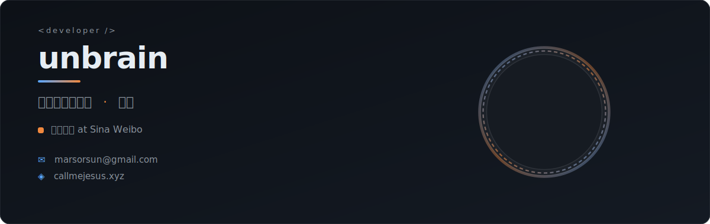
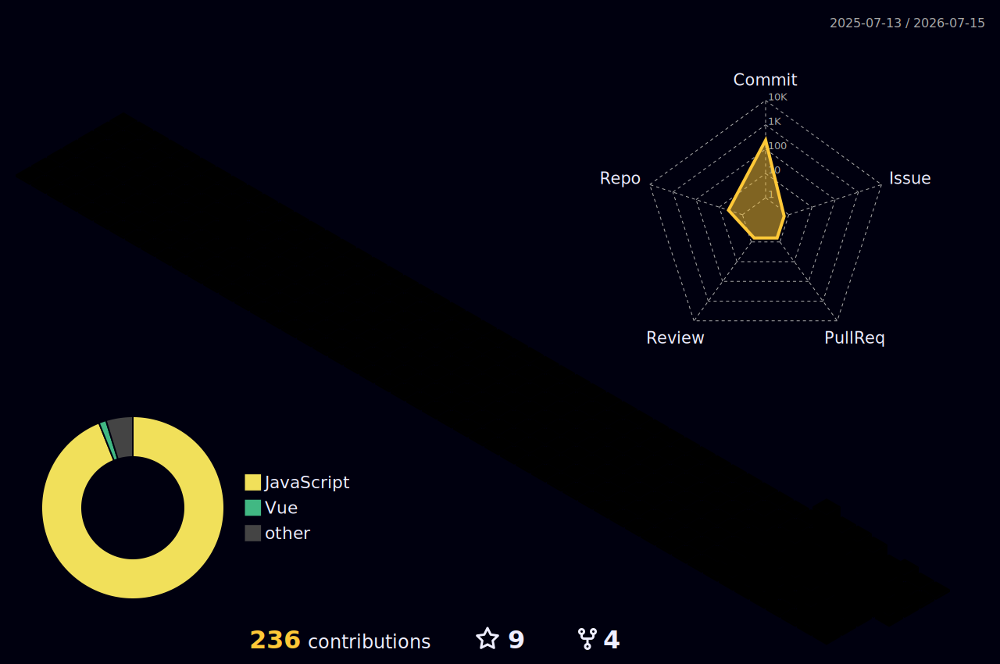

<p align="center">
  
</p>

<br>

<h2 align="center">
  🚀 Skills
  <br>
  
</h2>

<p align="center">
  <a href="https://skillicons.dev">
    
  </a>
</p>

<br>

<h2 align="center">
  📊 GitHub Stats
  <br>
  
</h2>

<p align="center">
  
</p>

<br>

<h2 align="center">
  ⏱ Coding Activity
  <br>
  
</h2>

<!--START_SECTION:waka-->


**I'm a Night 🦉** 

```text
🌞 Morning                296 commits         ██░░░░░░░░░░░░░░░░░░░░░░░   08.00 % 
🌆 Daytime                1187 commits        ████████░░░░░░░░░░░░░░░░░   32.09 % 
🌃 Evening                1787 commits        ████████████░░░░░░░░░░░░░   48.31 % 
🌙 Night                  429 commits         ███░░░░░░░░░░░░░░░░░░░░░░   11.60 % 
```


**I Mostly Code in JavaScript** 

```text
JavaScript               21 repos            ██████████░░░░░░░░░░░░░░░   41.18 % 
Vue                      12 repos            ██████░░░░░░░░░░░░░░░░░░░   23.53 % 
CSS                      5 repos             ██░░░░░░░░░░░░░░░░░░░░░░░   09.80 % 
TypeScript               4 repos             ██░░░░░░░░░░░░░░░░░░░░░░░   07.84 % 
Shell                    2 repos             █░░░░░░░░░░░░░░░░░░░░░░░░   03.92 % 
```


 Last Updated on 19/07/2026 08:01:54 UTC
<!--END_SECTION:waka-->

<br>

<h2 align="center">
  ⚡ Recent Activity
  <br>
  
</h2>

<!--RECENT_ACTIVITY:start-->
1. ⬆️ Pushed undefined commit(s) to [unbrain/unbrain](https://github.com/unbrain/unbrain)<br>
2. ⬆️ Pushed undefined commit(s) to [unbrain/unbrain](https://github.com/unbrain/unbrain)<br>
3. ⬆️ Pushed undefined commit(s) to [unbrain/unbrain](https://github.com/unbrain/unbrain)<br>
4. ⬆️ Pushed undefined commit(s) to [unbrain/unbrain](https://github.com/unbrain/unbrain)<br>
5. ⬆️ Pushed undefined commit(s) to [unbrain/unbrain](https://github.com/unbrain/unbrain)<br>
<!--RECENT_ACTIVITY:end-->

<!--RECENT_ACTIVITY:last_update-->
Last Updated: Saturday, July 18th, 2026, 8:02:06 AM
<!--RECENT_ACTIVITY:last_update_end-->

<br>

<h2 align="center">
  📫 Connect
  <br>
  
</h2>

<p align="center">
  <a href="https://www.callmejesus.xyz/">
    
  </a>
  &nbsp;
  <a href="mailto:marsorsun@gmail.com">
    
  </a>
</p>
