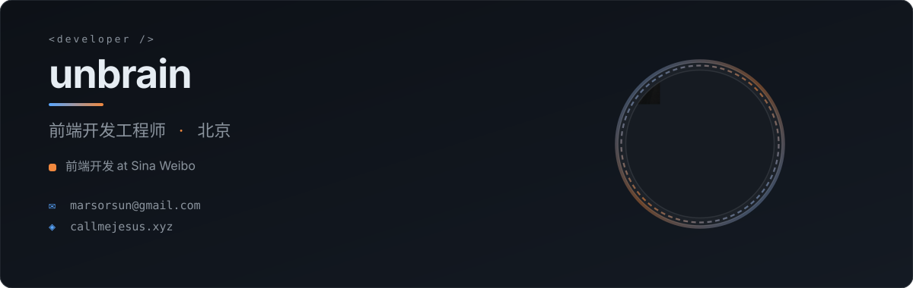
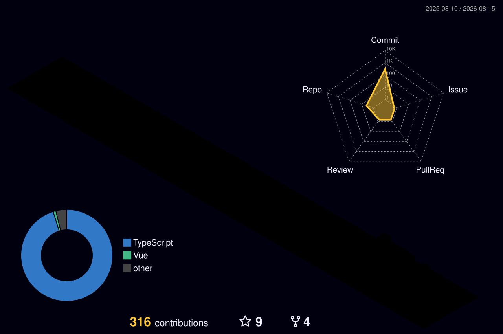

<p align="center">
  
</p>

<br>

<h2 align="center">
  🚀 Skills
  <br>
  
</h2>

<p align="center">
  <a href="https://skillicons.dev">
    
  </a>
</p>

<br>

<h2 align="center">
  📊 GitHub Stats
  <br>
  
</h2>

<p align="center">
  
</p>

<br>

<h2 align="center">
  ⏱ Coding Activity
  <br>
  
</h2>

<!--START_SECTION:waka-->


**I'm a Night 🦉** 

```text
🌞 Morning                296 commits         ██░░░░░░░░░░░░░░░░░░░░░░░   07.84 % 
🌆 Daytime                1187 commits        ████████░░░░░░░░░░░░░░░░░   31.44 % 
🌃 Evening                1802 commits        ████████████░░░░░░░░░░░░░   47.72 % 
🌙 Night                  491 commits         ███░░░░░░░░░░░░░░░░░░░░░░   13.00 % 
```


🤖 **AI Coding This Week** 

```text
⏱ AI Coding Time: 29 hrs 40 mins (79.56%)

✍️ 5,721 lines written by AI, 678 lines written by hand (89.4% AI-written)

🔤 135,435,269 Input Tokens, 784,988 Output Tokens

💵 $841.01 Estimated AI Cost This Week

🧠 1214 AI Sessions, 414 AI Prompts

OMP                      2,735 lines         ████████████░░░░░░░░░░░░░   46.14 % 
Opus                     2,387 lines         ██████████░░░░░░░░░░░░░░░   40.27 % 
Deepseek                 760 lines           ███░░░░░░░░░░░░░░░░░░░░░░   12.82 % 
Hy                       45 lines            ░░░░░░░░░░░░░░░░░░░░░░░░░   00.76 % 
Opencode-Cli             0 lines             ░░░░░░░░░░░░░░░░░░░░░░░░░   00.00 % 

🔎 AI Coding Insights:
🤖 AI-Driven — 89.4% of written lines came from AI
📝 Concise Prompter — average 221 characters per prompt
🎯 One-Shot Prompter — average 0 prompts per session
🚀 High AI Trust — 12.11% of changed lines were hand-edited
```

**I Mostly Code in JavaScript** 

```text
JavaScript               20 repos            ██████████░░░░░░░░░░░░░░░   39.22 % 
Vue                      12 repos            ██████░░░░░░░░░░░░░░░░░░░   23.53 % 
TypeScript               5 repos             ██░░░░░░░░░░░░░░░░░░░░░░░   09.80 % 
CSS                      5 repos             ██░░░░░░░░░░░░░░░░░░░░░░░   09.80 % 
Shell                    2 repos             █░░░░░░░░░░░░░░░░░░░░░░░░   03.92 % 
```


 Last Updated on 23/08/2026 06:25:53 UTC
<!--END_SECTION:waka-->

<br>

<h2 align="center">
  ⚡ Recent Activity
  <br>
  
</h2>

<!--RECENT_ACTIVITY:start-->
1. ⬆️ Pushed undefined commit(s) to [unbrain/unbrain](https://github.com/unbrain/unbrain)<br>
2. ⬆️ Pushed undefined commit(s) to [unbrain/unbrain](https://github.com/unbrain/unbrain)<br>
3. ⬆️ Pushed undefined commit(s) to [unbrain/unbrain](https://github.com/unbrain/unbrain)<br>
4. ⬆️ Pushed undefined commit(s) to [unbrain/unbrain](https://github.com/unbrain/unbrain)<br>
5. ⬆️ Pushed undefined commit(s) to [unbrain/unbrain](https://github.com/unbrain/unbrain)<br>
<!--RECENT_ACTIVITY:end-->

<!--RECENT_ACTIVITY:last_update-->
Last Updated: Saturday, August 22nd, 2026, 6:50:16 AM
<!--RECENT_ACTIVITY:last_update_end-->

<br>

<h2 align="center">
  📫 Connect
  <br>
  
</h2>

<p align="center">
  <a href="https://www.callmejesus.xyz/">
    
  </a>
  &nbsp;
  <a href="mailto:marsorsun@gmail.com">
    
  </a>
</p>
